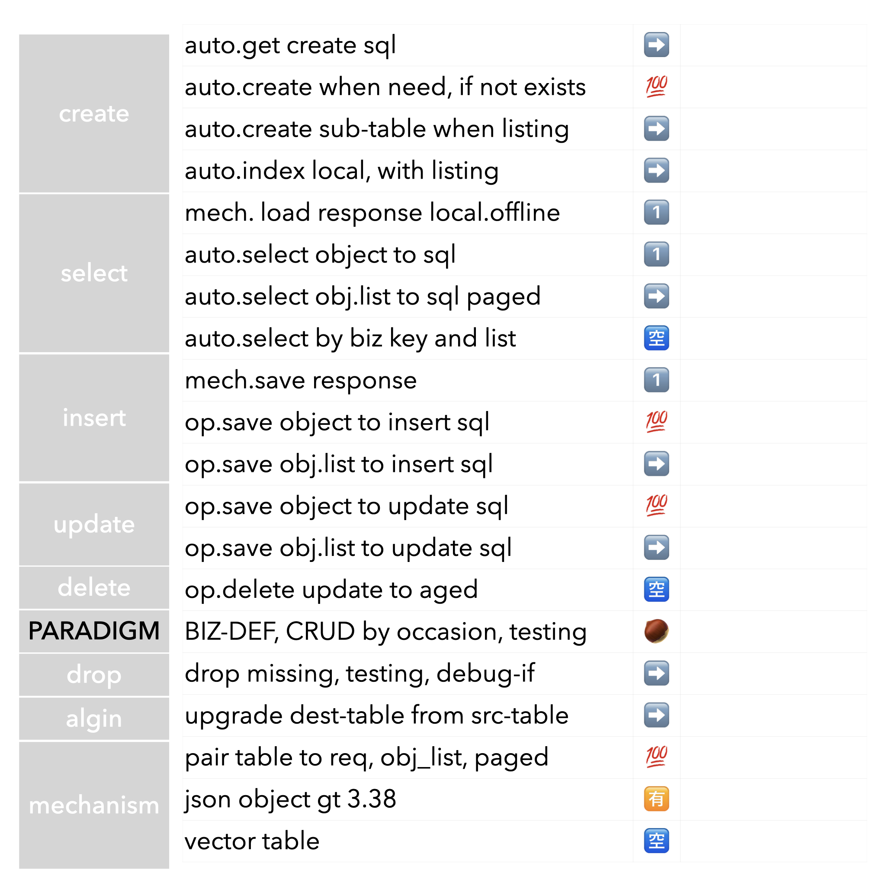

CuttDB

created by @biscutr2048

a sqlite3 access automation model

# top requirements

## auto table
    * hide on create sql
    * find table if not exist create auto
    * local index auto
    
## pair table
    * pair table to request
    * response save auto
    * offline request mode: load response auto from 
    * recover spec response manual ability

## auto moda encode
    * depends on response format, no need on a pre-defined table

## auto object
    * local object with property and listing
    * local object load
    * local object save

## patch for listing
    * listing recog
    * listing auto sub-table
    * listing update / insert
    * listing query / paged
    * listing recover response

## upgrade auto
    * upgrade destination table from source table auto align
    * matched turning
    * drop missing

## json friendly
    * sqlite 3.38 higher
        ** iOS 2020
        ** macos 11

## processing（2025-06-04）

## processing（2025-06-04）

| 需求项 | 状态 | 说明 |
|---|---|---|
| hide on create sql | ➡️ | 表创建SQL自动生成，但"隐藏"或完全自动化还不够 |
| find table if not exist create auto | 💯 | 已实现，自动检测并创建表 |
| local index auto | ➡️ | 未见自动创建索引逻辑 |
| pair table to request | 💯 | 已实现，表名自动与请求绑定 |
| response save auto | ✅ | 可自动生成SQL，保存需手动执行 |
| offline request mode: load response auto from | ✅ | 可恢复最近应答，离线模式需业务集成 |
| recover spec response manual ability | 💯 | 可手动恢复指定response |
| depends on response format, no need on a pre-defined table | 💯 | 已实现，无需预定义表 |
| local object with property and listing | ✅ | 属性/列表自动识别，类封装不够 |
| local object load | ✅ | 可加载对象，无专门对象模型 |
| local object save | ✅ | 可生成保存SQL，无专门对象模型 |
| listing recog | 💯 | 已实现，自动识别列表属性 |
| listing auto sub-table | 💯 | 已实现，自动建子表 |
| listing update / insert | 💯 | 已实现，自动生成SQL |
| listing query / paged | ✅ | 可查询子表，分页未实现 |
| listing recover response | 💯 | 已实现，子表可恢复response |
| upgrade destination table from source table auto align | ➡️ | 未见表结构自动升级逻辑 |
| matched turning | ❓ | 需求不明确，无法判断 |
| drop missing | ➡️ | 未见自动删除缺失字段/表逻辑 |

---

## 适用用户

- 需要自动管理SQLite表结构、自动处理response数据、自动生成SQL语句的开发者
- 需要离线恢复response、自动处理列表属性、自动建子表的开发者

---

## MIT授权声明

Copyright (c) 2025 BISCUTR

Permission is hereby granted, free of charge, to any person obtaining a copy of this software and associated documentation files (the "Software"), to deal in the Software without restriction, including without limitation the rights to use, copy, modify, merge, publish, distribute, sublicense, and/or sell copies of the Software, and to permit persons to whom the Software is furnished to do so, subject to the following conditions:

The above copyright notice and this permission notice shall be included in all copies or substantial portions of the Software.

THE SOFTWARE IS PROVIDED "AS IS", WITHOUT WARRANTY OF ANY KIND, EXPRESS OR IMPLIED, INCLUDING BUT NOT LIMITED TO THE WARRANTIES OF MERCHANTABILITY, FITNESS FOR A PARTICULAR PURPOSE AND NONINFRINGEMENT. IN NO EVENT SHALL THE AUTHORS OR COPYRIGHT HOLDERS BE LIABLE FOR ANY CLAIM, DAMAGES OR OTHER LIABILITY, WHETHER IN AN ACTION OF CONTRACT, TORT OR OTHERWISE, ARISING FROM, OUT OF OR IN CONNECTION WITH THE SOFTWARE OR THE USE OR OTHER DEALINGS IN THE SOFTWARE. 
